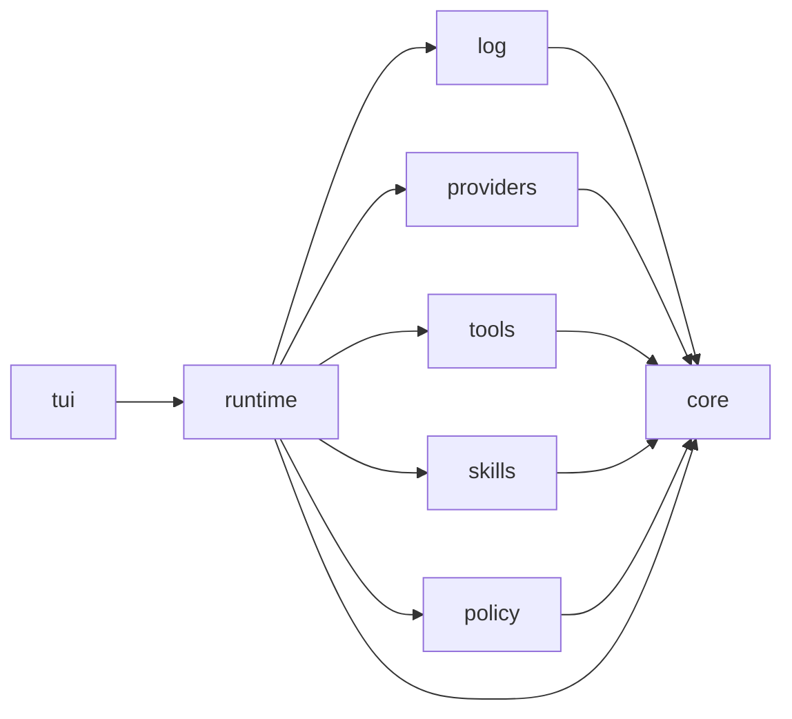

# Phase 0 plan

Status: draft · Follows `docs/PRD.md` (the Loop phase)

## 1. Cargo workspace layout

Nine crates. Dependency direction follows the PRD architecture table; `core` depends on nothing, everything else depends on `core`, and `runtime` is the only crate that knows the others. `skills` and `policy` are empty placeholders in phase 0, present only so `runtime` can already depend on them.

```
aigentic/                  # workspace root, single binary target later
├── Cargo.toml             # [workspace] members = all crates below
├── crates/
│   ├── core/              # canonical message, event, tool types + Provider/Tool traits
│   ├── log/               # JSONL event store, projections, resume
│   ├── providers/         # one adapter per backend (OpenAI-compatible first)
│   ├── tools/             # built-in tools + (phase 3) MCP client
│   ├── runtime/           # agent loop, scheduler, context builder, compaction
│   ├── tui/               # streaming REPL (phase 0), ratatui later
│   ├── skills/            # EMPTY placeholder (phase 3)
│   └── policy/            # EMPTY placeholder (phase 3)
```

Dependency direction (an edge means "depends on"):



`core` depends on no workspace crates and no `tokio`; it may pull in `serde`, `serde_json`, `schemars`, `ulid`, `futures-core` and the `time` crate. `tui` depends on the runtime API only.

## 2. Core crate signatures (no bodies)

```rust
// crates/core/src/role.rs
pub enum Role {
    User,
    Assistant,
    System,
    Tool, // wire-format concept: only the providers crate may branch on this variant
}

// crates/core/src/author.rs
#[serde(tag = "kind", rename_all = "snake_case")]
pub enum Author {
    User(UserId),
    Agent(AgentId),
    System,
}
// serialises as {"kind":"agent","id":"orchestrator"}

#[serde(transparent)]
pub struct UserId(pub String);
#[serde(transparent)]
pub struct AgentId(pub String);

// crates/core/src/content.rs
pub struct ToolCall {
    pub id: String,
    pub name: String,
    pub args: serde_json::Value,
}

pub struct ToolResult {
    pub id: String,          // links to the ToolCall.id it answers
    pub content: String,
    pub is_error: bool,
}

pub struct Image {
    pub media_type: String,  // e.g. "image/png"
    pub data: String,        // base64-encoded image data
}

pub struct ProviderBlob {
    pub provider: String,    // adapter that produced it; only that adapter replays it
    pub data: serde_json::Value,
}

pub enum ContentBlock {
    Text(String),
    ToolCall(ToolCall),
    ToolResult(ToolResult),
    Image(Image),
    ProviderBlob(ProviderBlob),
}

// crates/core/src/message.rs
pub struct Message {
    pub role: Role,
    pub author: Author,          // multiplayer attribution, even in single-user phase 0
    pub blocks: Vec<ContentBlock>,
}

// crates/core/src/event.rs
pub enum EventKind {
    UserMessage,
    AssistantMessage,
    ToolResult,
    TurnEnded,
    // phase 0 subset; the full PRD list (permission_requested, interrupted,
    // compacted, pinned, skill_loaded, ...) is added in later phases, never changed.
    // Tool calls are not an event kind: they live as ToolCall blocks inside the
    // assistant_message event.
}

pub struct Event {
    pub id: ulid::Ulid,
    pub thread_id: ulid::Ulid,
    pub seq: u64,
    pub kind: EventKind,
    pub author: Author,
    pub payload: serde_json::Value, // kind-specific JSON
    pub parent_event: Option<ulid::Ulid>, // tool_result -> its assistant_message
    pub created_at: time::OffsetDateTime, // serialised as RFC3339
}

// crates/core/src/provider.rs
pub struct Capabilities {
    pub supports_tools: bool,
    pub supports_images: bool,
    pub supports_caching: bool,
    pub supports_structured_output: bool,
    pub max_context_tokens: u64,
}

pub enum ProviderEvent {
    TextDelta(String),       // streaming token
    ToolCall(ToolCall),      // tool call arriving in the stream
    Usage { input_tokens: u64, output_tokens: u64 },
    Done { finish_reason: String },
    // ... (thinking/blob replay events surface here too)
}

pub trait Provider {
    fn complete(
        &self,
        context: &[Message],
    ) -> Pin<Box<dyn Stream<Item = ProviderEvent> + Send + '_>>;
    fn count_tokens(&self, context: &[Message]) -> u64;
    fn capabilities(&self) -> Capabilities;
}

// crates/core/src/tool.rs
pub enum RiskClass {
    Read,
    Write,
    Exec,
    Network,
    Safe,
}

pub struct ToolOutput {
    pub content: String,
    pub is_error: bool,
}

pub trait Tool {
    fn name(&self) -> &str;
    fn description(&self) -> &str;
    fn schema(&self) -> schemars::schema::RootSchema;
    fn risk_class(&self) -> RiskClass;
    fn call(&self, args: serde_json::Value) -> BoxFuture<'_, Result<ToolOutput, ToolError>>;
}

// thiserror enums in core; anyhow only in the tui binary
pub enum ProviderError { /* ... */ }
pub enum ToolError { /* ... */ }

// crates/core/src/budget.rs
pub struct Budget {
    pub max_iterations: u32,
    pub max_tokens: u64,
    pub max_wall_time: std::time::Duration,
}
```

## 3. JSONL event line format

One event per line, one file per thread, append-only. Shape matches the `Event` struct fields.

> The concrete example will be generated from the real types in the core crate tests (serde round-trip, one line per event kind) and pasted back here, so it cannot drift from the code.

## 4. Runtime loop (pseudocode)

```text
turn:                                       # scheduler / turn queue attaches here, later
  budget = project.budget
  context = build_context(log)              # stable prefix + thread body

  while not budget_exhausted(budget):
    # compaction hook attaches here, later

    blocks = []
    usage = None
    for chunk in provider.complete(context):
        if chunk is TextDelta or ToolCall:
            blocks.append(chunk)            # text deltas + tool calls, streamed
        if chunk is Usage:
            usage = chunk                   # recorded for /cost

    append(assistant_message, author=agent, blocks=blocks, usage=usage)

    calls = [b for b in blocks if b is ToolCall]
    if calls.empty():
        append(turn_ended, reason="done")
        return

    for call in calls:
        # policy check attaches here (phase 3)
        result = run_tool(call)             # tools crate
        append(tool_result, parent=assistant_message, call_id=call.id, result)

    context = build_context(log)            # rebuild once, results now in context

  append(turn_ended, reason=budget_reason(budget))
```

## 5. Decisions

1. `core` depends on no workspace crates and no `tokio`; it may use `serde`, `serde_json`, `schemars`, `ulid`, `futures-core` and `time`. `Provider` and `Tool` are object-safe: `complete` returns `Pin<Box<dyn Stream<Item = ProviderEvent> + Send + '_>>`, `call` returns `BoxFuture<'_, Result<ToolOutput, ToolError>>`.
2. Persist to JSONL in phase 0; the log writer is part of phase 0. Compaction is phase 2.
3. `Image.data` is a base64 `String` with a `media_type`.
4. `TextDelta` from the start; streaming is a phase 0 requirement.
5. `thiserror` enums in `core`: `ProviderError` and `ToolError`. `anyhow` only in the `tui` binary.
