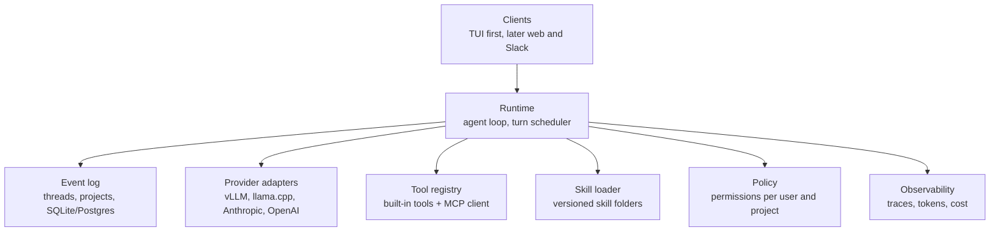
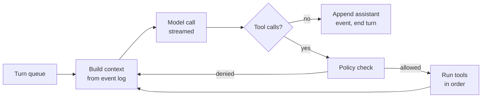
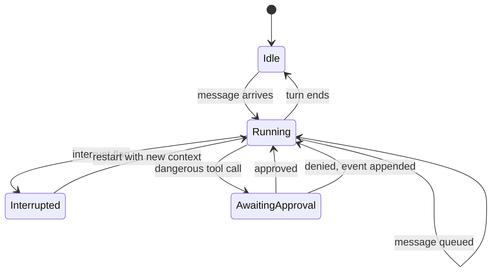
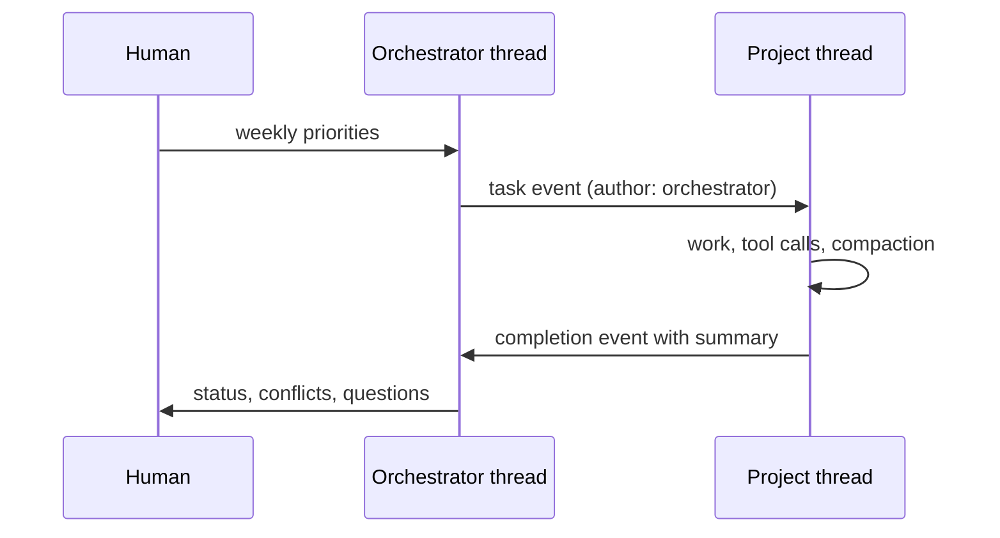

# Aigentic harness PRD

2026-09-21 · @Someone

## Purpose and scope

Aigentic is an open source agent harness, written in Rust, that runs open-weight models on EU infrastructure and ships first as a terminal application. The harness owns everything around the model: the loop, tools, skills, context management, persistence, permissions and the client. The model is a swappable backend.

Three ideas shape the design. Monothreading: one ordered event log per thread is the source of truth. Multiplayer: several humans and agents share a thread on equal terms. Projects: a scoping layer that carries instructions, knowledge and memory across threads. On top sits an orchestrator that coordinates work across projects without reading their threads.

### Success criteria

- The owner uses it daily for real work on at least two projects by the end of phase 4, in place of a commercial harness.
- Any OpenAI-compatible or Anthropic-compatible backend can be swapped in by configuration alone.
- A thread can be killed mid-turn and resumed from its log without loss beyond the in-flight call.
- Two people can work in one thread from two machines with attributed approvals by the end of phase 5.
- The repository is public from phase 0 and installable as a single binary.

### Non-goals for version 1

- A web client, hosted multi-tenant service, or billing.
- Fine-tuning or training of any kind.
- Self-hosted GPU inference; per-token EU providers serve all model tiers until measured volume justifies otherwise.
- Compatibility with any existing agent runtime beyond the MCP and SKILL.md conventions.

## Design principles

Eight rules, each with the consequence it forces on the code.

- **The model is a function.** Context in, one message out. The core never imports a provider SDK. Every provider is an adapter behind one trait.
- **The event log is the truth.** Every message, tool call, result, permission decision and compaction is an ordered event. Model context and UI are projections of the log. Nothing is mutated in place.
- **One thread, one writer, serial turns.** A thread executes one turn at a time. Incoming messages queue or interrupt, never race. Parallelism happens across threads, not inside one.
- **Open source, open weights, EU-hosted.** Default models are open-weight and served on our own hardware or an EU provider. Closed frontier APIs are adapters like any other, never assumed.
- **Skills and tools are data, not code.** A skill is a versioned folder the harness loads at runtime. Adding a skill never requires a rebuild.
- **Humans keep authority.** Permissions are per user and per project. Agents propose; a named human approves anything destructive or cross-project.
- **Stable prefix, cheap turns.** Context is built so the prefix does not change between turns. This is what makes caching and long threads affordable.
- **Plain files where a human might look.** Project knowledge, memory and skills live as readable files in git, not in an opaque store.

## Architecture overview

Seven layers, each a separate crate, with the runtime in the middle and everything else pluggable.



The runtime is the only crate that knows about all the others. Clients talk to it over a local socket or gRPC, so the TUI and a future web client are the same code path. The event log is the only stateful component.

| Crate | Owns | Depends on |
| --- | --- | --- |
| `core` | Canonical message, event and tool types | nothing |
| `runtime` | Loop, scheduler, context builder, compaction | core, log, providers, tools, skills, policy |
| `log` | Event store, projections, resume | core |
| `providers` | One adapter per backend | core |
| `tools` | Built-in tools, MCP client | core |
| `skills` | Discovery, loading, vetting metadata | core |
| `policy` | Permission rules and prompts | core |
| `tui` | Terminal client | runtime API only |

## The agent loop

The loop is small and should stay small: build context, call the model, run tool calls, append results, repeat until the model returns no tool calls or a budget is hit.



Everything the loop does is an event. A denied tool call is a `permission_denied` event the model sees on the next iteration. A budget stop is a `turn_ended` event with a reason. This keeps the loop free of special cases.

Turn scheduling lives outside the loop. A thread has one queue. A new user message while a turn is running is either queued (default) or marked as an interrupt. An interrupt cancels the current model call, appends an `interrupted` event and starts a new turn with the message in context. Cancellation must be clean: a tool already running finishes or is killed, and its outcome is recorded either way.

Budgets are per turn: max iterations, max tokens, max wall time. Defaults are conservative and projects can raise them. A turn that hits a budget ends with a message to the human, never with a silent stop.

## Provider layer and open-weight models

The core defines one canonical message type and one `Provider` trait; every backend is an adapter that translates both ways and nothing else.

The canonical message has a role, an author (for multiplayer), and a list of content blocks: text, tool call, tool result, image, and an opaque provider blob. The blob carries things like thinking blocks that must be replayed verbatim on the next call. The trait exposes `complete(context) -> stream of events`, `count_tokens(context)`, and a capability struct (supports tools, images, caching, structured output, max context).

What leaks through a naive abstraction, and where it goes:

- **Tool call shape.** Content blocks (Anthropic) versus a separate field and a `tool` role (OpenAI-style). Adapter.
- **Tool result placement.** Adapter.
- **Prompt caching.** Cache breakpoints are provider-specific; the runtime guarantees a stable prefix and the adapter decides where to mark it. Adapter, with a runtime contract.
- **Thinking or reasoning blocks.** Stored in the blob, replayed by the adapter that produced them, dropped by others.
- **Token counting.** Adapter, since tokenizers differ. Compaction thresholds are expressed as a fraction of the model's context, not absolute tokens.
- **Structured output.** Capability flag; the runtime falls back to a validate-and-retry loop when absent.

Build two adapters in week one: an OpenAI-compatible one (covers vLLM, llama.cpp, Mistral, most EU hosts) and Anthropic. An abstraction tested against one backend is not an abstraction.

### Model candidates

Open-weight coding models are now competitive on agentic benchmarks. Serving cost, not quality, is the real constraint for a solo operator. Figures approximate, from vendor-reported benchmarks as of mid-2026.

| Model | Size (total / active) | License | Terminal-Bench 2.1 | Fit |
| --- | --- | --- | --- | --- |
| [GLM-5.2](https://www.faros.ai/blog/open-weight-models) | 753B / 40B | MIT | 81.0 | Orchestrator-grade, needs a hosted EU provider |
| [Kimi K2.6](https://www.faros.ai/blog/open-weight-models) | 1.04T / 32B | Modified MIT | 66.7 | Orchestrator-grade, hosted only |
| [DeepSeek-V4-Pro](https://www.faros.ai/blog/open-weight-models) | 1.6T / 49B | MIT | 64.0 | Hosted only |
| [Qwen3-Coder-Next](https://modal.com/resources/best-open-source-code-llms-tool-calling-agents) | 80B / 3B | Apache 2.0 | 70.6 SWE-bench Verified | Project worker on one or two GPUs |
| [Qwen3-Coder-30B](https://modal.com/resources/best-open-source-code-llms-tool-calling-agents) | 30.5B / 3.3B | Apache 2.0 | not listed | Local dev, fast tool use |
| [Devstral Small](https://modal.com/resources/best-open-source-code-llms-tool-calling-agents) | 24B | Permissive | 46.8 SWE-bench Verified | Local dev, EU vendor (Mistral) |

### Hosting and inference providers

At solo volume, per-token EU inference beats a rented GPU: an H100 at about €3 per hour is €2,000 a month running continuously, which buys a very large number of tokens from any of the providers below. Self-host only for a model no provider serves or when volume proves it. Prices as of September 2026, per million tokens.

| Provider | Jurisdiction and location | Coding-grade models | Price example | Notes |
| --- | --- | --- | --- | --- |
| [Berget AI](https://infra.opensverige.se/en/leverantor/berget-ai) | Swedish company, data stays in Sweden | GLM 5.3 Flash, gpt-oss 120B, Qwen 3.8 27B, Gemma 4 31B | €0.20 to €0.90 input | OpenAI-compatible, no data stored after processing, ISO 27001 in progress, public DPA. No frontier-class open model yet. |
| [Scaleway Generative APIs](https://www.scaleway.com/en/generative-apis/) | French (Iliad), Paris only | GLM-5.2, DeepSeek-V4-flash, Qwen 3.8 27B, Mistral Medium 3.5 | GLM-5.2 €1.80 in, €5.50 out | OpenAI-compatible, no reuse of prompts, dedicated deployment via Managed Inference |
| [TensorX](https://tensorx.ai/models/) | Irish startup, UK company number, data centres in Dublin and Helsinki | GLM-5.3, Kimi K3, DeepSeek-V4-Pro, Qwen 3.8 2.4T | GLM-5.3 $1.75 in, $4.50 out | Widest lineup and cheapest, zero data retention, Blackwell GPUs. [Raised €8M in June 2026](https://thenextweb.com/news/tensorx-8-million-sovereign-ai-infrastructure); verify the contracting entity and DPA before relying on it. |
| [Scaleway GPU](https://www.scaleway.com/en/pricing/gpu/) | Paris, Warsaw | Any, self-hosted with vLLM | L4 from €0.79/h, H100 about €3/h | For self-hosting a Qwen3-Coder class model if volume justifies it |

Decision: local first, TensorX for inference. Through phase 4 the harness is a binary on the developer's own machine and the only remote dependency is the inference API. Hosting enters at phase 5, when a second person needs the daemon reachable and the log has to be shared, or earlier if the orchestrator should run on a schedule while the laptop is closed. At that point the daemon and Postgres go on Scaleway, in line with where Vendela already runs, with evroc as the target once it is ready; the daemon is a single binary plus Postgres so the move is small. TensorX serves both model tiers: a flash-class model (GLM-5.3 Flash or Qwen 3.8 Flash Next at $0.20 in, $0.50 out) for project workers and GLM-5.3 or Kimi K3 for the orchestrator. Phase 0 can also run against a local model over llama.cpp for offline work.

The provider choice is reversible by design. All candidates are OpenAI-compatible, so switching is a base URL and a key in `project.toml`. Berget is the preferred long-term provider because Swedish jurisdiction is the stronger story for Nordic customers; the switch happens when its lineup matches TensorX on model freshness and performance, reviewed at each phase boundary. The TensorX DPA review listed under open items must pass before any customer data is processed through it; until then it serves the owner's own repositories only. Frontier APIs (Anthropic, OpenAI) remain available as adapters for comparison runs.

## Event log, threads and monothreading

A thread is an append-only sequence of events. Model context, the terminal view, cost reports and resume are all projections of that sequence, never separate state.

| Field | Type | Notes |
| --- | --- | --- |
| `id` | ULID | Sortable, unique across threads |
| `thread_id` | ULID | Owning thread |
| `seq` | integer | Position in thread, gapless |
| `kind` | enum | see below |
| `author` | user id, agent id or `system` | Multiplayer attribution |
| `payload` | JSON | Kind-specific |
| `parent_event` | ULID, optional | Links a tool result to its call, a summary to its range |
| `created_at` | timestamp |  |

Event kinds for the first version: `user_message`, `assistant_message`, `tool_call`, `tool_result`, `permission_requested`, `permission_decided`, `interrupted`, `turn_ended`, `compacted`, `pinned`, `skill_loaded`. New kinds are added, never changed; old logs must always replay.

Storage follows the field convention: append-only JSONL on disk, one file per thread, one event per line, the same shape Claude Code and Codex use. It is greppable, diffable and resumable with no database. SQLite arrives later as a derived index for cross-thread search, and Postgres only in server mode. Writes go through one writer per thread, which is what monothreading means in practice: one turn at a time, one append at a time, no locks beyond that.

### Context projection

The context builder walks the log and emits canonical messages. Order matters for caching: global instructions, project instructions, project knowledge, pinned facts, then the thread body oldest to newest. Everything before the thread body is stable across turns. The body only grows at the end.

### Compaction

Compaction replaces a range of events with one `compacted` event holding a summary, without deleting the originals. Rules, applied in order:

1. Truncate large tool results first. Keep the call, keep the first and last lines of the result, note the size. This alone recovers most of a full context.
2. Summarise the oldest turns when usage passes a project-configured fraction of the model's window (default 70 percent). Keep the last N turns raw (default 8).
3. Pinned events are never summarised. The model can pin a fact with a tool; humans can pin from the client.
4. Summaries are written by the same model that runs the thread, with a fixed prompt, and stored as events so they are auditable.

Resume is a replay: open the log, project, continue. There is no session state outside the log, so a crash mid-turn loses at most the in-flight model call.

## Projects

A project is a scoping record: standing instructions, a knowledge folder, a tool and skill allowlist, a default model, participants, and the threads that inherit all of it. It is the same idea as [Claude's projects](https://support.claude.com/en/articles/9517075-what-are-projects), made explicit as data.

On disk a project is a directory in a git repo, so humans can read and edit it and the harness can diff it:

```
projects/vendela/
  project.toml      # model, budgets, participants, allowlists
  instructions.md   # standing instructions for this project
  knowledge/        # documents loaded or indexed into context
  memory/           # facts the harness extracts over time
  skills/           # project-specific skill overrides
```

### Instruction layering

Context is assembled from three layers, each able to narrow but not widen the one above.

| Layer | Holds | Can change |
| --- | --- | --- |
| Global | Who the agent is, house rules, safety policy | Owner only |
| Project | What this venture is, conventions, priorities, allowed tools and skills | Project participants |
| Thread | Pinned facts, task at hand, temporary narrowing of tools | Anyone in the thread |

### Knowledge loading

Small projects load the whole knowledge folder into the stable prefix. This gives better behaviour than retrieval and is cache-friendly. When the folder exceeds a threshold (default 40 percent of the model's window) the harness switches to a retrieval tool over the same files, with a short index in the prefix so the model knows what exists. Retrieval-only from day one is a mistake; the switch is per project and automatic.

### Project memory

Memory is a periodic extraction over the project's event logs that writes facts, decisions and constraints into `memory/` as markdown. It runs after turns, not during, and only files what a participant stated. Humans edit the files directly when the harness gets it wrong. The files are part of the prefix, so memory changes invalidate the cache once and are then stable again.

## Multiplayer

Several humans and agents share one thread, and the event log's single writer is what makes that safe. The terminal version is single-user, but the log, the author field and the permission model are multiplayer from day one so nothing needs rewriting.

### Server mode

The runtime moves from in-process to a daemon. Clients append events and subscribe to a stream over a local socket first, then a network socket with auth. The TUI is the first client of that API, which keeps the API honest. Postgres replaces SQLite when more than one machine needs the log.

### Attribution

Every user event carries an author. The context projection renders them as `Steve:` and `Magnus:` rather than an anonymous user role, so the model can tell people apart and address them. Agents are authors too; the orchestrator posting into a project thread looks like a named participant.

### Turn-taking

One turn at a time per thread. Messages arriving mid-turn queue by default. A message flagged as interrupt cancels the turn. Whether the agent responds to every message or only when addressed is a project setting; the default is to respond when addressed or when a queued message is directed at it.



### Permissions

Permissions are per user per project: read, write, approve, admin. A dangerous tool call raises a `permission_requested` event that any user with approve rights can answer; the decision is an event with its author. Tools that act on external systems run under a service identity by default, with per-user delegated credentials as an opt-in later.

## Orchestrator

The orchestrator is an ordinary agent whose project is the portfolio, running on the strongest model available, and it never reads project threads.

Its context is thin and structured: one status file per project, recent completion events, open questions, and the portfolio's own instructions. Its tools are few: `list_projects`, `read_status`, `post_task`, `await_result`, `ask_human`. If it ever needs a project's detail it asks the project agent, which answers with a summary event.

Coordination is messages between threads over the same event log.



Model split follows from the provider layer: the orchestrator gets the large hosted model, project workers get the self-hosted one, and each project record names its own. Changing the split is configuration.

Authority stays with humans. The orchestrator may propose and schedule; reprioritising across projects requires a human with approve rights on the portfolio. Start by running the orchestrator role by hand, posting task events yourself. Automate the loop only once the same morning routine has repeated for a few weeks, because by then the status format and the tool list will be obvious.

## Skills

A skill is a folder with a `SKILL.md` (frontmatter plus instructions) and optional scripts and references, loaded at runtime, never compiled in. The harness ships with [Matt Pocock's skills](https://github.com/mattpocock/skills/) (MIT) as its default set, vendored and version-pinned.

### What a skill is here

- Frontmatter: `name`, `description` (what decides when it triggers), `invocation` (`user` or `model`), `version`, `requires` (tools the skill needs), `source` (upstream repo and commit).
- The description of every enabled skill sits in the stable prefix. The body is loaded into the thread as a `skill_loaded` event only when the skill is invoked, so unused skills cost a line each, not a page.
- User-invoked skills are slash commands in the TUI. Model-invoked skills are offered as a `load_skill` tool and the model picks by description.
- A skill may call tools and other skills, but only ones in the project's allowlist. A skill's `requires` list is checked at load time and a missing tool fails loudly.
- Skills resolve in order: project `skills/`, user `~/.harness/skills/`, bundled. Same name closer wins, which is how a project overrides a bundled one.

### The Pocock set

The repo splits into user-invoked orchestrators (`grill-with-docs`, `to-spec`, `to-tickets`, `implement`, `triage`, `wayfinder`, `grill-me`, `handoff`, `teach`) and model-invoked reusables (`tdd`, `diagnosing-bugs`, `code-review`, `codebase-design`, `grilling`, `writing-for-agents`). Two conventions in it are worth adopting harness-wide: model-invoked skills never call user-invoked ones, and skills lean on a per-project `CONTEXT.md` for shared vocabulary. Our `instructions.md` plays that role. The repo's `/setup-matt-pocock-skills` step (issue tracker, labels, doc location) becomes fields in `project.toml`.

### Vetting

A skill is text the model follows, so it is a prompt injection surface and is treated like a dependency.

1. Bundled and third-party skills are vendored into the repo with the upstream commit recorded. Nothing loads from the network at runtime.
2. Every skill has a lockfile entry: name, version, source, content hash. A hash mismatch refuses to load.
3. On import, the harness runs a static check: tools referenced, URLs present, shell in scripts, and any instruction that widens permissions or asks to ignore project rules. Findings go to a human before the skill is enabled.
4. Skills that ship scripts run them through the same policy layer as any tool call. No exemptions for being bundled.
5. A skill is enabled per project, never globally by default.

### Maintaining

- `harness skills update` fetches upstream, shows a diff per skill, and re-runs the static check. Nothing changes until a human accepts the diff.
- Every `skill_loaded` event records the version, so a regression in agent behaviour can be traced to a skill change.
- Cheap evals: for each skill, a handful of recorded threads where it should trigger and a handful where it should not. Run after updates; the trigger rate is the metric. The [skill-creator](https://github.com/anthropics/skills) pattern of description tuning applies.
- Project overrides are diffed against the bundled version in the same update command, so a fork does not drift silently.
- Local skills we write follow the same frontmatter and live in git next to the project.

## Tools and MCP

Built-in tools cover the filesystem, shell, search and the harness itself; everything external comes in over MCP so the tool boundary is a spec we do not own.

| Tool | Purpose | Risk class |
| --- | --- | --- |
| `read_file`, `list_dir`, `grep` | Read the workspace | read |
| `write_file`, `edit_file` | Change the workspace | write |
| `bash` | Run a command with a timeout and output cap | exec |
| `web_fetch`, `web_search` | Read the web | network |
| `load_skill`, `pin`, `ask_human` | Harness self-management | safe |
| `post_task`, `await_result` | Cross-thread messaging, orchestrator only | write |

Each tool declares a risk class and a JSON schema. The policy layer maps class to behaviour per project: allow, ask, or deny. `bash` gets an extra allow-pattern list (build and test commands) so the common case does not prompt. Tool output passes through the truncation rules before it reaches the log.

MCP: the harness is an MCP client from the first version, over stdio and streamable HTTP. MCP servers are declared per project and their tools appear in the registry with a `network` or `write` class by default until a human downgrades them. Tool descriptions from a server are untrusted text and are shown to the human at connect time. Being an MCP server ourselves, so other harnesses can drive ours, comes later.

## Language and stack

Decision: Rust. The reasons are distribution and correctness, not speed; a harness spends its time waiting on the model, so runtime speed barely registers. Building competence in Rust is a stated goal of the project, which settles the trade-off below.

What Rust buys: one static binary that installs with `curl | sh` or `cargo install`, fast startup for a terminal tool, an event log and canonical types that the compiler checks, and a daemon that runs for weeks without a memory story. What it costs: slower iteration than TypeScript, a thinner ecosystem around LLM tooling, and a first month spent on the borrow checker in exactly the places a harness lives: async code, shared state, long-lived objects. Rust has no manual memory management; ownership is checked at compile time, so the cost is design friction, not memory bugs. The monothreading design helps: one actor per thread with serial turns keeps shared state small and most of the borrow checker quiet. Prompts, skills and project files are data, so the parts that change most often need no rebuild.

Alternatives considered: TypeScript would be the fastest path given existing familiarity and is the right call if shipping in six weeks mattered more than the learning. Go gives the static binary without the borrow checker. Python was ruled out for a terminal daemon because packaging and distribution are its weak spot. Language choice does not change the harness's real security surface, which is the shell tool, prompt injection through tool output and skills, and the dependency supply chain.

| Concern | Crate | Note |
| --- | --- | --- |
| Async runtime | `tokio` | Everything is IO-bound |
| HTTP client | `reqwest` | Streaming SSE from providers |
| Serialization | `serde`, `serde_json` | Canonical types, event payloads |
| JSON schema for tools | `schemars` | Derive schemas from tool input structs |
| Storage | JSONL via `serde_json`; `rusqlite` as index later, `sqlx` for Postgres in server mode | Log is the truth, databases are derived |
| MCP | `rmcp` (official Rust SDK) | Client now, server later |
| Terminal UI | `ratatui` + `crossterm` | See next section |
| CLI | `clap` | Subcommands for skills, projects, threads |
| Tracing | `tracing` + OpenTelemetry exporter | Every model call is a span with tokens and cost |
| Config | `toml` | `project.toml`, user config |
| IDs | `ulid` | Sortable event ids |

Write provider adapters by hand against raw HTTP rather than pulling a vendor SDK per provider. The OpenAI-compatible adapter covers vLLM, llama.cpp, Mistral and most hosts, which keeps the count at two.

## Terminal application

The first client is a plain streaming REPL, not a full-screen TUI; the full-screen version comes once the runtime API has settled, because a TUI written against a moving API is rewritten twice.

Phase one client: read a line, stream the assistant's text and tool calls as they happen, print tool output truncated, prompt inline for permissions. Slash commands for skills, `/project`, `/thread`, `/pin`, `/compact`, `/cost`. This is enough to use daily and it exercises every runtime feature.

Phase two client, in `ratatui`: a thread pane, a status bar with model, tokens and cost, a side pane for pinned facts and queued messages, and a permission prompt that does not steal the input line. Multiplayer shows other authors' messages arriving live because the client is already a subscriber to the event stream.

Both clients talk to the runtime over the same in-process API in the beginning and the same socket API later. Rendering markdown in the terminal, syntax highlighting and diff views are nice and are deferred; the value is in the runtime, and the client should stay thin enough that a web client is a weekend.

## Build order

Seven phases, each ending in something used daily before the next starts. Durations assume evenings and some weekends.

| Phase | Builds | Done when | Rough time |
| --- | --- | --- | --- |
| 0 Loop | Canonical types, one adapter (OpenAI-compatible against local vLLM or llama.cpp), three tools, streaming REPL | Can edit a file and run tests in a real repo | 1 week |
| 1 Two providers | Anthropic adapter, capability struct, caching contract, thinking blob | Same thread runs on both backends without code changes | 1 week |
| 2 Event log | SQLite log, projection, resume, truncation and summary compaction, `/cost` | Kill the process mid-turn and resume cleanly; a 200-turn thread stays under budget | 2 weeks |
| 3 Skills and policy | Skill loader with lockfile and static check, Pocock set vendored, risk classes, permission prompts | `implement` and `tdd` run end to end; no tool call bypasses policy | 2 weeks |
| 4 Projects | `project.toml`, instruction layering, knowledge loading with automatic retrieval switch, memory extraction | Two real projects (Vendela and one more) run from their own folders | 2 weeks |
| 5 Server and multiplayer | Daemon, socket API, authors, turn queue and interrupts, per-user permissions, TUI as subscriber | Two people in one thread from two machines, approvals attributed | 3 weeks |
| 6 Orchestrator | Portfolio project, status files, `post_task` and `await_result`, hosted large model adapter | Morning routine runs from one thread and posts into project threads | 2 weeks |

MCP client lands in phase 3 alongside the tool registry. The `ratatui` client lands after phase 5, once the API is stable. Publish the repo from phase 0 with a clear "not ready" note; building in public from the start is cheaper than a launch later.

## Decisions and open items

Nothing blocks phase 0. The items below are settled decisions, timed tasks, and defaults recorded to close them.

### Decided

- Repo name: aigentic (domain aigentic.tech).
- Licence: MIT. Short, permissive, no NOTICE file or patent clauses to maintain. The patent grant Apache 2.0 adds matters for projects with many corporate contributors, which this is not; if that changes, relicensing needs every contributor's consent, so the choice is made now with that known.

### Tasks with a known time

- [ ] TensorX DPA review before any customer data flows (phase 4 at the earliest): contracting entity (Irish vs UK), sub-processors, retention in practice, whether the UK registration matters for the sovereignty story. Berget's public DPA as the comparison. About an hour of reading.
- [ ] Inference break-even: the point at which renting a GPU and running vLLM ourselves beats paying per token. The app itself (daemon plus Postgres) is a small VM either way and is not part of this. Measure monthly token spend after a month of real use; revisit only if it passes a few hundred euro.

### Defaults set, no longer tracked

- Orchestrator budget: a daily token budget in the portfolio project's config, set by the owner, same mechanism as per-turn budgets.
- Tool identity in multiplayer: service account only through phase 5; delegated credentials only if a customer requires it.
- Memory extraction model: the project's own model. One config field to change later.
- Retrieval backend: grep or BM25 over markdown first; embeddings only if measured misses justify them.
